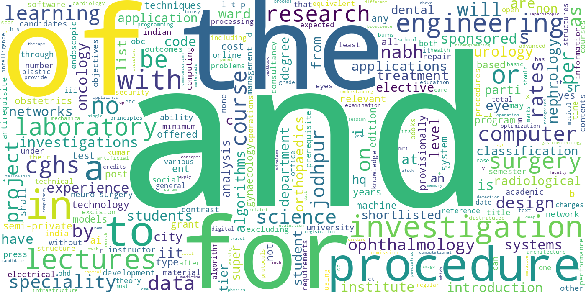
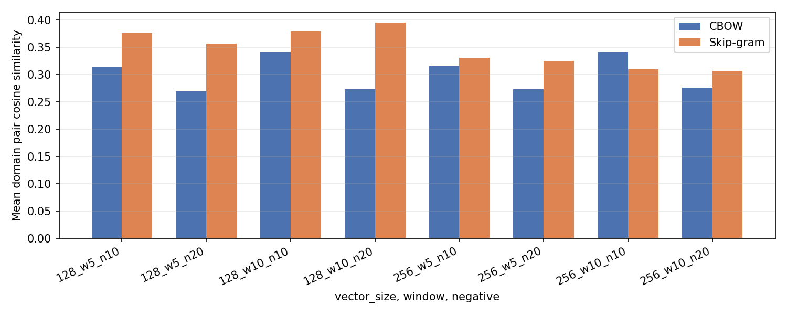
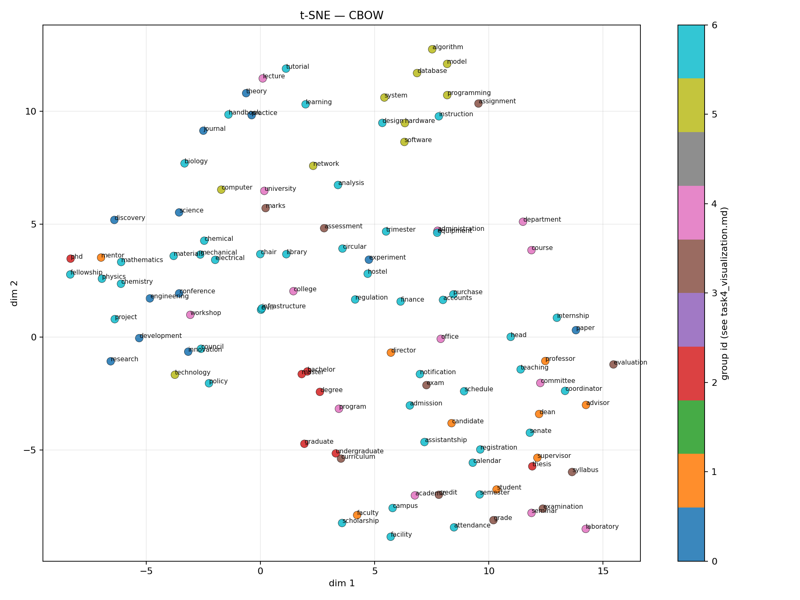
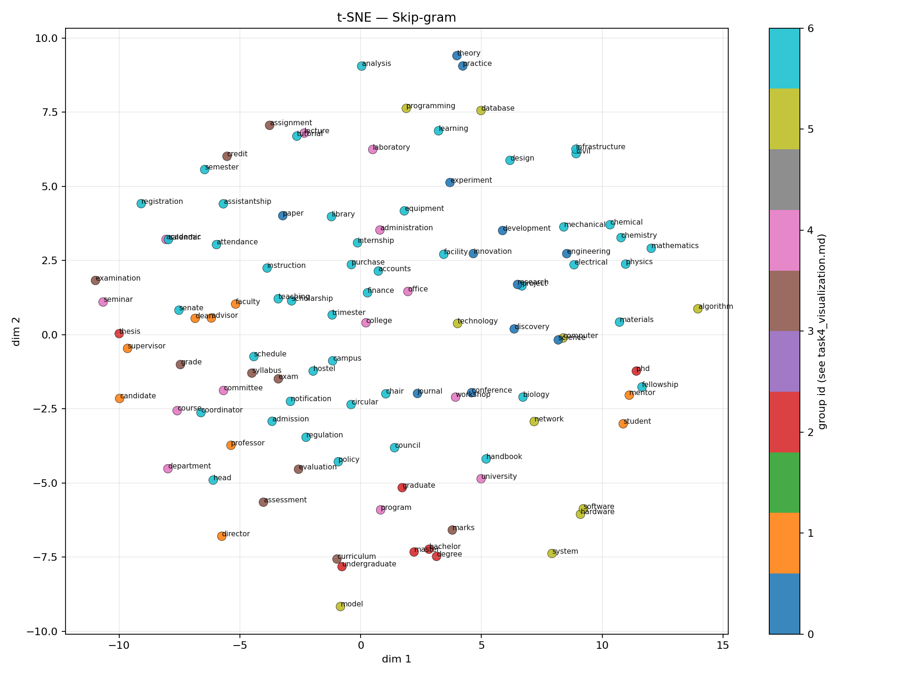
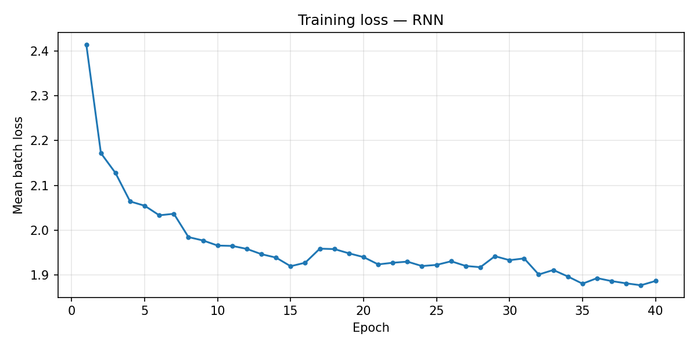
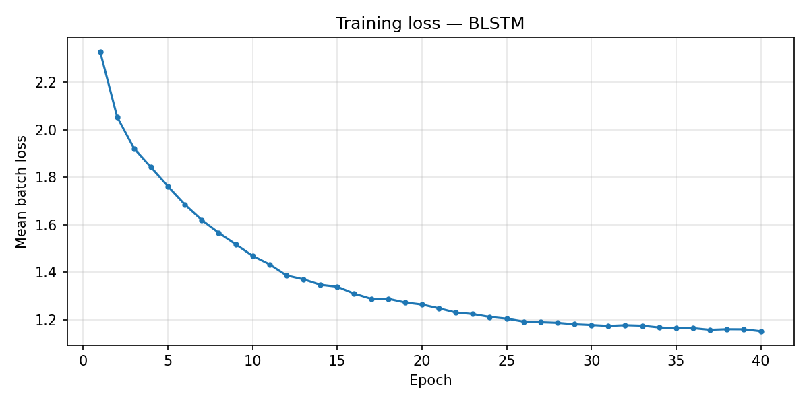
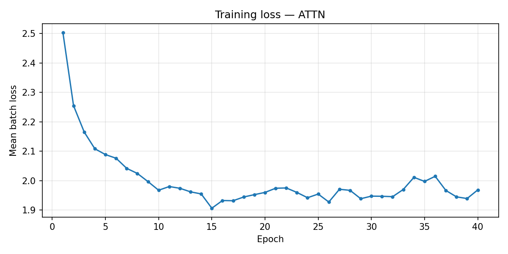

# NLU Assignment 2 — Report

---

# Problem 1: IITJ web corpus, Word2Vec, semantics, and visualization

## Task 1: Corpus collection

**Goal:** Build an English tokenized corpus from IIT Jodhpur–related web/PDF text for downstream Word2Vec training.

**Pipeline:** Priority PDF/HTML seeds → bounded BFS on `*.iitj.ac.in` → text extraction → English filter → NLTK tokenization → `problem1/output/corpus_tokens.pkl` (metadata: `corpus_meta.json`).

**Statistics** (current `corpus_meta.json`)

| Metric | Value |
| --- | ---: |
| Documents | 915 |
| Tokens | 192,621 |
| Distinct types (tokenizer) | 13,846 |

**Analysis:** The corpus is **domain-specific** (regulations, courses, institute pages). Intrinsic benchmarks that assume general English will show **low absolute scores**; comparisons across *your own* runs remain meaningful.

### Corpus word cloud (token frequency)

Top tokens by unigram count over all sentences (`corpus_tokens.pkl`). Generated with `wordcloud`; larger area ⇒ higher frequency.

---

## Task 2 — Word2Vec training and comparison

**Goal:** Train **CBOW** (`sg=0`) and **Skip-gram** (`sg=1`) with negative sampling; sweep embedding size, window, and number of negatives; record loss and intrinsic checks.

**Setup:** `gensim.models.Word2Vec`, `min_count=2`, `epochs=25`, `sorted_vocab=True`, `ns_exponent=0.75`. Grid: **`vector_size` ∈ {128, 256}**, **`window` ∈ {5, 10}**, **`negative` ∈ {10, 20}** → **16 models** per architecture (32 total). Full metrics: `problem1/output/w2v_experiments.csv`.

**Loss:** Reported `training_loss` is gensim’s running negative-sampling loss. **Do not** compare CBOW vs Skip-gram raw loss, or runs with different `negative`, on loss alone.

**Intrinsic evaluation**

| Signal | Role |
| --- | --- |
| Google analogies (`questions-words.txt`) | Often **near zero** on this corpus (OOV / rare words); use for **relative** comparison only. |
| Domain analogies (`problem1/domain_analogies.txt`) | Short file → coarse accuracy. |
| Domain pair cosine similarity | Hand-picked related pairs (both words must be in vocab); `domain_pairs_used` = 7. |

**Results (highlights from `w2v_experiments.csv`, gensim vocab size **10,145**)**

| Notable | Config (arch, d, win, neg) | Google acc | Domain acc | Pair sim |
| --- | --- | ---: | ---: | ---: |
| Best Google analogy | CBOW, 256, 5, 20 | **0.0066** | 0.0 | 0.273 |
| Best domain pair sim | Skip-gram, 128, 10, 20 | 0.0 | 0.2 | **0.395** |
| Strong domain acc | CBOW, 128, 5, 10 | 0.0044 | **0.2** | 0.313 |

**Analysis:** Skip-gram with **w=10, neg=20, d=128** maximizes **domain pair similarity** in this sweep. CBOW sometimes wins **domain analogy** hits. Google scores stay tiny; **pair similarity + qualitative neighbors** (Task 3) are more informative here than headline analogy accuracy.

### Domain pair similarity by configuration (Task 2)

Mean cosine similarity over the seven hand-picked domain pairs (`problem1/w2v_common.py`), for each **(vector_size, window, negative)** in the grid — **CBOW** vs **Skip-gram**.

---

## Task 3 — Semantic analysis (qualitative)

**Goal:** Compare **CBOW** vs **Skip-gram** on cosine neighbors and vector-offset analogies using **one** fixed config per architecture: `vector_size=200`, `window=10`, `negative=15`, `epochs=25` (`problem1/task3_semantic.py`).

**Neighbors (summary):** Neighbors track **co-occurrence on institute pages**, not abstract WordNet synonyms. Example: **exam** → **marital**, **belongs**, **status** (form/table boilerplate near the token “exam”). **research** → CBOW: local tokens (**phase**, **advances**); Skip-gram: **project**, **sponsored**. **phd** → funding/lab terms (**dst-inspire**, **perovskite**). Full tables: `problem1/output/task3_semantic_analysis.md`, `task3_neighbors.csv`.

**Offset analogies (examples):** `ug : btech :: pg : ?` → both models rank **undergraduation**, **diploma**, **bsc** highly — sensible **degree-level** structure for this corpus.

---

## Task 4 — 2D embedding visualization

**Goal:** Project embeddings for words present in **both** Task 3 vocabularies (**107** types) with **PCA** (global linear view) and **t-SNE** (local structure, `perplexity=21`). L2-normalized rows; colors = coarse manual themes (research, people, credentials, assessment, org, tech, other).

**Variance (PCA, from latest `task4_visualize` run):** CBOW ~**20.8%** on first two components; Skip-gram ~**10.1%** (typical when variance spreads across many dimensions).

### CBOW

### Skip-gram

**Analysis:** PCA: Skip-gram’s first two components explain **less** combined variance than CBOW here; both are modest (high-D overlap). t-SNE: interpret **within-cluster** proximity, not distances between distant clusters.

---

# Problem 2 — Character-level Indian name generation

## Task 0 — Dataset

**Content:** **1,000 unique** Indian **first** names, one per line. Generated via **`google-genai`** in batches (e.g. 250/request) with a **set** enforcing uniqueness, or **`--mock`** offline. Implementation: `problem2/generate_training_names.py`. Training file used locally: `problem2/data/TrainingNames.txt`.

---

## Task 1 — Models and training setup

Three architectures in `problem2/models.py`, trained with `problem2/colab_train_all.py` (artifacts under `problem2/problem2_colab_out/`).

| Model | Idea | Trainable params (this run) |
| --- | --- | ---: |
| **Vanilla RNN** | Char embedding → stacked tanh RNN → logits; teacher forcing; autoregressive sampling at test time. | 30,236 |
| **Prefix BLSTM** | Forward LSTM on prefix + backward LSTM on reversed prefix; concat **2H** → next-char logits; no future peek. | 207,644 |
| **RNN + attention** | RNN states as memory; Bahdanau-style additive attention over prefix states; classify from **[h_t ; context]**. | 66,844 |

**Shared hyperparameters** (`training_summary.json`): embedding **64**, hidden **128**, layers **1**, batch **32**, epochs **40**, Adam, grad clip **5.0**, learning rate **0.02** (default CLI/notebook often uses **0.002** — this run used **0.02**). Vocabulary size **28** characters.

### Training loss curves (mean batch loss vs epoch)

**Reading:** **BLSTM** reaches the lowest training loss. **RNN** decreases steadily. **Attention** improves then fluctuates in late epochs.

---

## Task 2 — Quantitative comparison (generation quality)

**Procedure:** `python -m problem2.run_eval_all` → `problem2/evaluate.py`: generate **500** names per model (`temperature=0.85`), compare to training set for **novelty** and **diversity**.

| Model | Novelty | Diversity |
| --- | ---: | ---: |
| RNN | 0.928 | 0.916 |
| Prefix BLSTM | 0.052 | 0.730 |
| RNN + attention | 0.896 | 0.882 |

- **Novelty:** fraction of generated names **not** in the training set (normalized string).
- **Diversity:** unique / total in the generated list.

**Analysis:** **BLSTM** gets the **lowest novelty**: it often reproduces **training or very common** names (memorization), which can look “realistic” but fails the novelty criterion. **RNN** scores highest on novelty and diversity; **attention** is close behind on novelty with some **prefix repetition** in samples (see Task 3).

---

## Task 3 — Qualitative analysis

**Realism:** RNN mixes plausible short names with occasional odd spellings. BLSTM samples often look like **real** names (overlap with training). Attention produces many **shared prefixes** (`ra-`, etc.) and occasional garbled tokens.

**Failure modes:** RNN/Attn: unlikely letter strings, morpheme repetition. BLSTM: **copying** training names → **low novelty**.

**Representative lines** (from `eval_*.samples.txt`)

**RNN:** `kakom`, `jazwan`, `chevashinal`, `kalbir`, `meenal`, `suresh`, …

**BLSTM:** `vidushi`, `rajeshwari`, `kumar`, `amrita`, `anand`, …

**RNN + attention:** `rabin`, `ranya`, `rasini`, `rabivavi`, `latika`, …

---

## Artifact index

| Location | Contents |
| --- | --- |
| `problem1/output/corpus_meta.json`, `corpus_tokens.pkl` | Corpus stats and tokens |
| `problem1/output/w2v_experiments.csv` | Task 2 full grid |
| `problem1/output/task3_semantic_analysis.md`, `task3_neighbors.csv` | Task 3 |
| `problem1/output/plots/task4_*.png` | Task 4 PCA/t-SNE (source; copied into `report_assets/`) |
| `problem2/problem2_colab_out/` | Checkpoints, loss PNGs, JSON, eval outputs |
| `output/report_assets/` | **Figures embedded in this report** (word cloud, W2V bar chart, Task 4, loss curves) |

**Refresh embedded figures:** `uv run python output/generate_report_assets.py`  
**Regenerate Problem 1 Task 4 plots:** `uv run python -m problem1.task4_visualize`  
**Re-run Problem 2 eval:** `uv run python -m problem2.run_eval_all --train-data problem2/data/TrainingNames.txt --checkpoint-dir problem2/problem2_colab_out`
