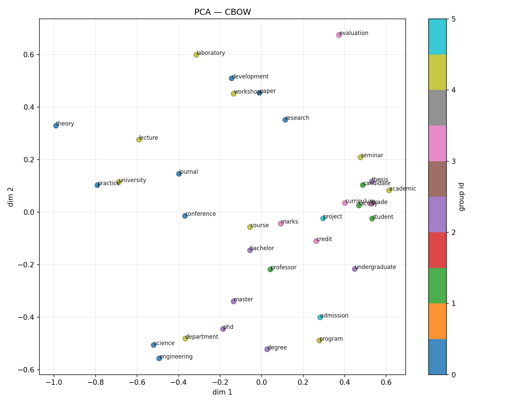
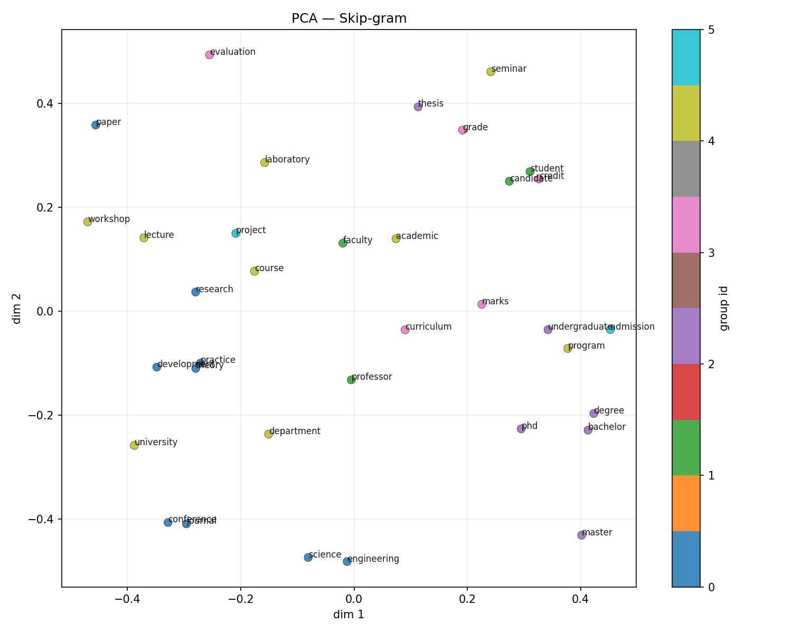
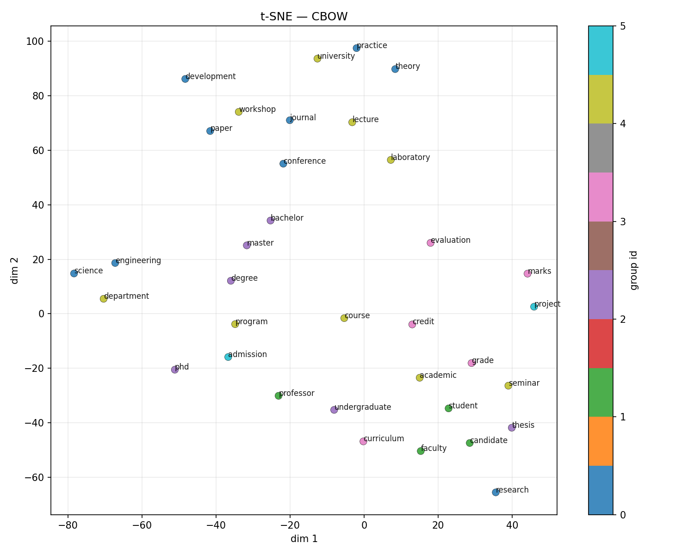
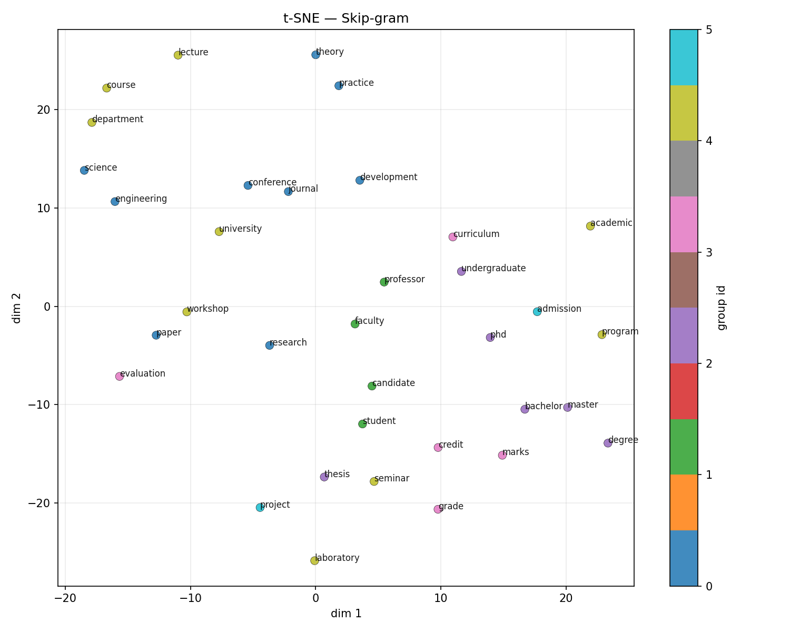

# Task 2: Word2Vec model training — report

## 1. Objective

Train two **Word2Vec** architectures with **negative sampling** on the Task 1 corpus:

- **CBOW** (`sg=0`) predicts a target word from averaged context embeddings.
- **Skip-gram** (`sg=1`) predicts context words from the target embedding.

For each architecture, systematically vary **embedding dimension** (`vector_size`), **context window** (`window`), and **number of negative samples** (`negative`), record training loss and intrinsic evaluation scores, and compare configurations.

## 2. Data

| Statistic | Value |
| --- | ---: |
| Documents (tokenized units from Task 1) | 167 |
| Total tokens | 42879 |
| Vocabulary (types, Task 1 tokenizer) | 6251 |

Training uses `min_count=2`, `epochs=25`, `sorted_vocab=True`, and the same lowercased token strings as Task 1.

## 3. Methodology

- **Implementation:** `gensim.models.Word2Vec` (Mikolov-style skip-gram / CBOW with negative sampling). Reported `training_loss` is gensim’s running negative-sampling loss; it scales with `negative`, so compare loss **only** across runs with the **same** `negative` (and same `epochs`).
- **Negative sampling:** `negative` controls how many “noise” draws per positive pair; `ns_exponent=0.75` matches the smoothed unigram distribution used in the original work.
- **Embedding dimension:** larger `vector_size` increases representational capacity but, on a **small** corpus, can overfit or fragment the frequency budget across dimensions.
- **Context window:** larger `window` mixes more distant co-occurrences (broader “semantic” context) but dilutes the immediate predictive signal; Skip-gram often benefits more from wide windows than CBOW because each (target, context) pair is a separate training example.
- **Evaluation (intrinsic):**
  - **Google analogy benchmark** (`questions-words.txt` shipped with gensim): many items are **out-of-vocabulary** on a narrow domain corpus, so **absolute accuracy is often near zero**; it still offers a **comparable relative** signal across runs with identical evaluation settings (`restrict_vocab=40000`, case-insensitive).
  - **Domain analogies** (`domain_analogies.txt`): morphology and academic-style relations using vocabulary more likely to appear in institute text.
  - **Domain pair similarity:** mean cosine similarity between hand-picked related pairs (only pairs where both words exist in the model vocabulary are averaged; `domain_pairs_used` records how many contributed).

Full numeric results are in `task2_results.csv`.

## 4. Results (all runs)

| architecture | vector_size | window | negative | training_loss | google_analogy_acc | domain_analogy_acc | domain_pair_sim | domain_pairs_used | train_seconds | vocab_size |
| --- | --- | --- | --- | --- | --- | --- | --- | --- | --- | --- |
| CBOW | 100 | 3 | 5 | 427867.031200 | 0.000000 | 0.000000 | 0.753186 | 6 | 1.08 | 2985 |
| Skip-gram | 100 | 3 | 5 | 1601697.875000 | 0.016949 | 0.000000 | 0.481905 | 6 | 1.31 | 2985 |
| CBOW | 100 | 3 | 15 | 567766.375000 | 0.000000 | 0.000000 | 0.662147 | 6 | 1.37 | 2985 |
| Skip-gram | 100 | 3 | 15 | 2186816.750000 | 0.008475 | 0.000000 | 0.431531 | 6 | 3.54 | 2985 |
| CBOW | 100 | 3 | 25 | 705862.750000 | 0.000000 | 0.000000 | 0.658012 | 6 | 1.62 | 2985 |
| Skip-gram | 100 | 3 | 25 | 2388412.250000 | 0.008475 | 0.000000 | 0.428983 | 6 | 5.23 | 2985 |
| CBOW | 100 | 6 | 5 | 412139.062500 | 0.000000 | 0.000000 | 0.718141 | 6 | 0.96 | 2985 |
| Skip-gram | 100 | 6 | 5 | 2601161.000000 | 0.000000 | 0.000000 | 0.401877 | 6 | 2.29 | 2985 |
| CBOW | 100 | 6 | 15 | 568120.000000 | 0.000000 | 0.000000 | 0.622108 | 6 | 1.38 | 2985 |
| Skip-gram | 100 | 6 | 15 | 3391698.000000 | 0.000000 | 0.000000 | 0.409351 | 6 | 4.99 | 2985 |
| CBOW | 100 | 6 | 25 | 653194.437500 | 0.008475 | 0.000000 | 0.597927 | 6 | 1.41 | 2985 |
| Skip-gram | 100 | 6 | 25 | 3946035.250000 | 0.000000 | 0.000000 | 0.418608 | 6 | 7.52 | 2985 |
| CBOW | 100 | 10 | 5 | 408080.093800 | 0.016949 | 0.000000 | 0.681771 | 6 | 0.85 | 2985 |
| Skip-gram | 100 | 10 | 5 | 3718899.000000 | 0.008475 | 0.000000 | 0.392244 | 6 | 2.78 | 2985 |
| CBOW | 100 | 10 | 15 | 576219.750000 | 0.008475 | 0.000000 | 0.562954 | 6 | 1.07 | 2985 |
| Skip-gram | 100 | 10 | 15 | 5038782.000000 | 0.000000 | 0.000000 | 0.398053 | 6 | 7.17 | 2985 |
| CBOW | 100 | 10 | 25 | 657044.687500 | 0.008475 | 0.000000 | 0.535402 | 6 | 1.74 | 2985 |
| Skip-gram | 100 | 10 | 25 | 6290170.000000 | 0.000000 | 0.250000 | 0.407575 | 6 | 14.15 | 2985 |
| CBOW | 200 | 3 | 5 | 435189.500000 | 0.000000 | 0.000000 | 0.770544 | 6 | 1.19 | 2985 |
| Skip-gram | 200 | 3 | 5 | 1694868.375000 | 0.008475 | 0.000000 | 0.472958 | 6 | 2.0 | 2985 |
| CBOW | 200 | 3 | 15 | 623776.500000 | 0.000000 | 0.000000 | 0.674323 | 6 | 1.59 | 2985 |
| Skip-gram | 200 | 3 | 15 | 2399903.750000 | 0.008475 | 0.000000 | 0.444393 | 6 | 4.48 | 2985 |
| CBOW | 200 | 3 | 25 | 714559.250000 | 0.000000 | 0.000000 | 0.644080 | 6 | 2.56 | 2985 |
| Skip-gram | 200 | 3 | 25 | 2608966.000000 | 0.008475 | 0.000000 | 0.435875 | 6 | 8.16 | 2985 |
| CBOW | 200 | 6 | 5 | 438428.656200 | 0.000000 | 0.000000 | 0.749921 | 6 | 1.3 | 2985 |
| Skip-gram | 200 | 6 | 5 | 2778677.250000 | 0.000000 | 0.000000 | 0.400511 | 6 | 2.99 | 2985 |
| CBOW | 200 | 6 | 15 | 633151.437500 | 0.000000 | 0.000000 | 0.630724 | 6 | 1.63 | 2985 |
| Skip-gram | 200 | 6 | 15 | 3736834.500000 | 0.000000 | 0.250000 | 0.390992 | 6 | 7.93 | 2985 |
| CBOW | 200 | 6 | 25 | 708121.250000 | 0.000000 | 0.000000 | 0.610467 | 6 | 2.19 | 2985 |
| Skip-gram | 200 | 6 | 25 | 4245162.000000 | 0.000000 | 0.000000 | 0.399295 | 6 | 12.07 | 2985 |
| CBOW | 200 | 10 | 5 | 420923.468800 | 0.000000 | 0.000000 | 0.674315 | 6 | 1.3 | 2985 |
| Skip-gram | 200 | 10 | 5 | 3892752.250000 | 0.000000 | 0.250000 | 0.369435 | 6 | 4.44 | 2985 |
| CBOW | 200 | 10 | 15 | 578279.562500 | 0.008475 | 0.000000 | 0.564220 | 6 | 1.51 | 2985 |
| Skip-gram | 200 | 10 | 15 | 5368187.500000 | 0.000000 | 0.250000 | 0.352884 | 6 | 10.35 | 2985 |
| CBOW | 200 | 10 | 25 | 657306.562500 | 0.016949 | 0.000000 | 0.563915 | 6 | 2.11 | 2985 |
| Skip-gram | 200 | 10 | 25 | 5808521.500000 | 0.000000 | 0.250000 | 0.361817 | 6 | 15.38 | 2985 |
| CBOW | 300 | 3 | 5 | 461959.437500 | 0.000000 | 0.000000 | 0.759909 | 6 | 0.96 | 2985 |
| Skip-gram | 300 | 3 | 5 | 1713460.000000 | 0.016949 | 0.000000 | 0.498173 | 6 | 2.05 | 2985 |
| CBOW | 300 | 3 | 15 | 620126.812500 | 0.000000 | 0.000000 | 0.720320 | 6 | 1.66 | 2985 |
| Skip-gram | 300 | 3 | 15 | 2184158.500000 | 0.000000 | 0.000000 | 0.453313 | 6 | 4.64 | 2985 |
| CBOW | 300 | 3 | 25 | 678512.562500 | 0.000000 | 0.000000 | 0.674944 | 6 | 2.23 | 2985 |
| Skip-gram | 300 | 3 | 25 | 2316808.750000 | 0.000000 | 0.000000 | 0.467112 | 6 | 7.04 | 2985 |
| CBOW | 300 | 6 | 5 | 428117.656200 | 0.000000 | 0.000000 | 0.734153 | 6 | 1.02 | 2985 |
| Skip-gram | 300 | 6 | 5 | 2707530.250000 | 0.000000 | 0.250000 | 0.423957 | 6 | 3.16 | 2985 |
| CBOW | 300 | 6 | 15 | 598543.375000 | 0.008475 | 0.000000 | 0.645532 | 6 | 1.82 | 2985 |
| Skip-gram | 300 | 6 | 15 | 3564693.500000 | 0.000000 | 0.000000 | 0.400079 | 6 | 7.71 | 2985 |
| CBOW | 300 | 6 | 25 | 668174.250000 | 0.000000 | 0.000000 | 0.619615 | 6 | 2.25 | 2985 |
| Skip-gram | 300 | 6 | 25 | 3637592.750000 | 0.000000 | 0.000000 | 0.419652 | 6 | 11.91 | 2985 |
| CBOW | 300 | 10 | 5 | 447734.312500 | 0.000000 | 0.000000 | 0.677306 | 6 | 1.19 | 2985 |
| Skip-gram | 300 | 10 | 5 | 3837104.250000 | 0.000000 | 0.000000 | 0.376600 | 6 | 5.12 | 2985 |
| CBOW | 300 | 10 | 15 | 594162.687500 | 0.016949 | 0.000000 | 0.587922 | 6 | 1.78 | 2985 |
| Skip-gram | 300 | 10 | 15 | 5043408.500000 | 0.000000 | 0.000000 | 0.369307 | 6 | 11.58 | 2985 |
| CBOW | 300 | 10 | 25 | 665349.562500 | 0.016949 | 0.000000 | 0.553715 | 6 | 2.37 | 2985 |
| Skip-gram | 300 | 10 | 25 | 5559846.000000 | 0.000000 | 0.250000 | 0.356738 | 6 | 17.51 | 2985 |

## 5. Analysis

### 5.1 Best configurations (by metric)

| Model | Best on Google analogies | Best on domain analogies |
| --- | --- | --- |
| CBOW | `d=100, window=10, negative=5` (google_analogy_acc=0.0169) | `d=100, window=3, negative=5` (domain_analogy_acc=0.0000) |
| Skip-gram | `d=100, window=3, negative=5` (google_analogy_acc=0.0169) | `d=100, window=10, negative=25` (domain_analogy_acc=0.2500) |

### 5.2 Embedding dimension (`vector_size`)

Increasing dimensionality raises model capacity. On **small** corpora, very large embeddings can memorize idiosyncratic co-occurrences without improving general analogy or similarity structure; mid-range dimensions (e.g. 100–300) are a common compromise. In your table, compare rows that share the same `window` and `negative` to isolate the effect of `vector_size` on `training_loss` and analogy scores.

### 5.3 Context window (`window`)

A **narrow** window emphasizes syntactic and immediate collocations (e.g. multi-word phrases). A **wide** window pulls in more document-level co-occurrence signal. Skip-gram typically scales better with larger windows because it emits more independent (center, context) training pairs per sentence. CBOW averages context vectors, so an overly large window can **blur** the context representation, sometimes hurting fine-grained prediction.

### 5.4 Negative samples (`negative`)

More negative samples approximate the softmax denominator more sharply and can stabilize training, but each additional negative increases work per positive example. Values around **5–25** are standard; if `training_loss` and analogy metrics plateau, increasing `negative` further may yield diminishing returns.

### 5.5 CBOW vs Skip-gram

**Skip-gram** tends to perform better on **rare words** because it generates more training updates per rare token. **CBOW** is often faster and can be stronger for **frequent** words when data are abundant. On small domain corpora, Skip-gram is frequently the stronger default for semantic retrieval and analogy-style tests, but the winning configuration should be read from your table rather than assumed.

## 6. Conclusion

This experiment grid isolates the effects of **vector size**, **context window**, and **negative sampling** under a fixed tokenizer and corpus. Use the **relative** ordering of `domain_analogy_acc`, `domain_pair_sim`, and `training_loss` (together with qualitative checks such as `model.wv.most_similar`) to choose a deployment configuration for downstream NLU tasks. For publication-style claims, complement intrinsic scores with an **extrinsic** task (e.g. classification or clustering) on the same domain.

---
*Generated by `task2.py`. Re-run after changing `SOURCE_URLS`, using `--rebuild-corpus`, or editing the hyperparameter grids in `task2.py`.*

<!-- NLU_TASK3_4_START -->
## 7. Task 3: Semantic analysis (cosine similarity)

### 7.1 Setup

For qualitative analysis we trained **one CBOW** and **one Skip-gram** model with the **same** hyperparameters: `vector_size=100`, `window=6`, `negative=5`, `epochs=25`, `min_count=2`, negative sampling with `ns_exponent=0.75`. **Nearest neighbors** use **cosine** similarity via `gensim.models.KeyedVectors.most_similar`.

### 7.2 Top-5 nearest neighbors

If a query is out-of-vocabulary, we try aliases from `QUERY_ALIASES` (e.g. **exam** → **examination**).

| Query | Resolved | Model | Rank | Neighbor | Cosine |
| --- | --- | --- | ---: | --- | ---: |
| research | research | CBOW | 1 | rfcs | 0.8915 |
| research | research | CBOW | 2 | relevant | 0.8531 |
| research | research | CBOW | 3 | interested | 0.8523 |
| research | research | CBOW | 4 | papers | 0.8475 |
| research | research | CBOW | 5 | drafts | 0.8469 |
| research | research | Skip-gram | 1 | proposal | 0.6258 |
| research | research | Skip-gram | 2 | collaborations | 0.6211 |
| research | research | Skip-gram | 3 | interdisciplinary | 0.6194 |
| research | research | Skip-gram | 4 | years | 0.6156 |
| research | research | Skip-gram | 5 | drafts | 0.6078 |
| student | student | CBOW | 1 | who | 0.9729 |
| student | student | CBOW | 2 | allowed | 0.9683 |
| student | student | CBOW | 3 | candidacy | 0.9618 |
| student | student | CBOW | 4 | completed | 0.9600 |
| student | student | CBOW | 5 | if | 0.9570 |
| student | student | Skip-gram | 1 | casual | 0.7723 |
| student | student | Skip-gram | 2 | repeat | 0.7711 |
| student | student | Skip-gram | 3 | requesting | 0.7686 |
| student | student | Skip-gram | 4 | allowed | 0.7663 |
| student | student | Skip-gram | 5 | attendance | 0.7652 |
| phd | phd | CBOW | 1 | mtech | 0.9888 |
| phd | phd | CBOW | 2 | offered | 0.9759 |
| phd | phd | CBOW | 3 | shortlisted | 0.9549 |
| phd | phd | CBOW | 4 | btech | 0.9504 |
| phd | phd | CBOW | 5 | semester-ii | 0.9317 |
| phd | phd | Skip-gram | 1 | mtech | 0.9055 |
| phd | phd | Skip-gram | 2 | shortlisted | 0.8714 |
| phd | phd | Skip-gram | 3 | semester-ii | 0.8473 |
| phd | phd | Skip-gram | 4 | pre-requisites | 0.8416 |
| phd | phd | Skip-gram | 5 | tech | 0.8358 |
| exam | exam → examination | CBOW | 1 | one | 0.9835 |
| exam | exam → examination | CBOW | 2 | after | 0.9822 |
| exam | exam → examination | CBOW | 3 | comprehensive | 0.9803 |
| exam | exam → examination | CBOW | 4 | additional | 0.9770 |
| exam | exam → examination | CBOW | 5 | under | 0.9763 |
| exam | exam → examination | Skip-gram | 1 | make-up | 0.8678 |
| exam | exam → examination | Skip-gram | 2 | seminar | 0.8667 |
| exam | exam → examination | Skip-gram | 3 | comprehensive | 0.8613 |
| exam | exam → examination | Skip-gram | 4 | candidacy | 0.8583 |
| exam | exam → examination | Skip-gram | 5 | minutes | 0.8396 |

Full long-form table: `task3_neighbors.csv`.

### 7.3 Analogy experiments (vector offset)

For each prompt **A : B :: C : ?** we rank tokens by cosine similarity to **B − A + C**. Abbreviations (**ug**, **pg**, **btech**) map to the first matching synonym present in the vocabulary (see `_alts` in `task3_4.py`).

#### `ug : btech :: pg : ?`

- **CBOW** — vectors for (ug, btech, pg).

| Rank | Prediction | Cosine |
| ---: | --- | ---: |
| 1 | sc | 0.8994 |
| 2 | assignment | 0.8935 |
| 3 | mtech | 0.8904 |
| 4 | tech | 0.8884 |
| 5 | phd | 0.8699 |

- **Skip-gram** — vectors for (ug, btech, pg).

| Rank | Prediction | Cosine |
| ---: | --- | ---: |
| 1 | ee | 0.8705 |
| 2 | l-t-p-c | 0.8673 |
| 3 | mtech | 0.8552 |
| 4 | branches | 0.8448 |
| 5 | bridge | 0.8151 |

#### `undergraduate : bachelor :: graduate : ?`

- **CBOW** — vectors for (undergraduate, bachelor, pg).

| Rank | Prediction | Cosine |
| ---: | --- | ---: |
| 1 | iits | 0.9136 |
| 2 | basagni | 0.9135 |
| 3 | nagaraj | 0.9128 |
| 4 | conti | 0.9084 |
| 5 | maura | 0.9053 |

- **Skip-gram** — vectors for (undergraduate, bachelor, pg).

| Rank | Prediction | Cosine |
| ---: | --- | ---: |
| 1 | inanyrelevantdiscipline | 0.8351 |
| 2 | fouryeardurationinengineering | 0.8066 |
| 3 | applicant | 0.7819 |
| 4 | ora | 0.7811 |
| 5 | happen | 0.7564 |

#### `faculty : professor :: student : ?`

- **CBOW** — vectors for (faculty, professor, student).

| Rank | Prediction | Cosine |
| ---: | --- | ---: |
| 1 | sgpa | 0.9364 |
| 2 | dues | 0.9195 |
| 3 | clearance | 0.9185 |
| 4 | major | 0.9156 |
| 5 | unique | 0.9137 |

- **Skip-gram** — vectors for (faculty, professor, student).

| Rank | Prediction | Cosine |
| ---: | --- | ---: |
| 1 | pg | 0.6644 |
| 2 | normally | 0.6253 |
| 3 | approved | 0.6252 |
| 4 | only | 0.6242 |
| 5 | senate | 0.6209 |

#### `course : credit :: degree : ?`

- **CBOW** — vectors for (course, credit, degree).

| Rank | Prediction | Cosine |
| ---: | --- | ---: |
| 1 | dual | 0.8854 |
| 2 | minimum | 0.8292 |
| 3 | convenience | 0.8230 |
| 4 | primal | 0.8215 |
| 5 | program | 0.8213 |

- **Skip-gram** — vectors for (course, credit, degree).

| Rank | Prediction | Cosine |
| ---: | --- | ---: |
| 1 | dual | 0.7415 |
| 2 | sum | 0.6668 |
| 3 | relaxation | 0.6526 |
| 4 | qualifying | 0.5993 |
| 5 | rules | 0.5989 |

#### `science : engineering :: theory : ?`

- **CBOW** — vectors for (science, engineering, theory).

| Rank | Prediction | Cosine |
| ---: | --- | ---: |
| 1 | graph | 0.8648 |
| 2 | discrete | 0.8579 |
| 3 | visual | 0.8405 |
| 4 | siam | 0.8205 |
| 5 | processing | 0.8193 |

- **Skip-gram** — vectors for (science, engineering, theory).

| Rank | Prediction | Cosine |
| ---: | --- | ---: |
| 1 | blocks | 0.4753 |
| 2 | discrete | 0.4732 |
| 3 | classes | 0.4728 |
| 4 | co-design | 0.4703 |
| 5 | north-holland | 0.4659 |

### 7.4 Discussion (semantic plausibility)

- **Neighbors:** On a **small, domain-specific** corpus, neighbors often reflect **document co-occurrence** (committee names, local collocations) as much as abstract synonymy. CBOW **smooths** context, which can yield **higher cosine** with broad topical associates; Skip-gram **emphasizes** predictive links and often surfaces rarer but informative contexts.

- **Analogies:** Offset analogies assume linear relations between embeddings. They succeed when **A:B** and **C:?** correspond to a **consistent** relation learned from data (e.g. parallel degree naming). Spelling variants (**ug** vs **undergraduate**) and OOV tokens break analogies; when all tokens are in-vocabulary, inspect whether top predictions are **paraphrases**, **siblings in a taxonomy**, or **artifacts** of shared boilerplate.

## 8. Task 4: Visualization (PCA and t-SNE)

### 8.1 Word set

We projected **L2-normalized** embeddings for a fixed list of domain-relevant types that appear in **both** vocabularies (see script `task3_4.py`). Colors mark coarse groups (research, people, credentials, assessment, organization, other).

### 8.2 Figures and captions

**Figure (PCA, CBOW).** File `task4_pca_cbow.png`. Two principal components capture about **54.5%** of variance in the selected embedding matrix (L2-normalized rows). Points are colored by coarse category (research/teaching, people, credentials, assessment, org). PCA is linear and preserves global structure; nearby points share major variance directions.

**Figure (PCA, Skip-gram).** File `task4_pca_skipgram.png`. Two principal components capture about **24.3%** of variance in the selected embedding matrix (L2-normalized rows). Points are colored by coarse category (research/teaching, people, credentials, assessment, org). PCA is linear and preserves global structure; nearby points share major variance directions.

**Figure (t-SNE, CBOW).** File `task4_tsne_cbow.png`. Nonlinear projection (perplexity≈8) of the same vectors. Local neighborhoods are emphasized; distances across disjoint clusters are not strictly comparable.

**Figure (t-SNE, Skip-gram).** File `task4_tsne_skipgram.png`. Nonlinear projection (perplexity≈8) of the same vectors. Local neighborhoods are emphasized; distances across disjoint clusters are not strictly comparable.

### 8.3 CBOW vs Skip-gram clustering

- **CBOW** vectors are trained to predict the center from **averaged** context; clusters in PCA often align with **broad topical blobs** (frequent words dominate the average).

- **Skip-gram** updates each context direction separately, which tends to preserve **finer** relational structure; t-SNE may show **tighter** micro-clusters of synonyms or role-related words, but can also separate **low-frequency** types if context evidence is sparse.

- **PCA vs t-SNE:** PCA highlights **global** linear separations; t-SNE highlights **local** neighborhoods. Use PCA for a coarse layout check and t-SNE for neighborhood structure, without over-interpreting **between-cluster** t-SNE distances.

<!-- NLU_TASK3_4_END -->
