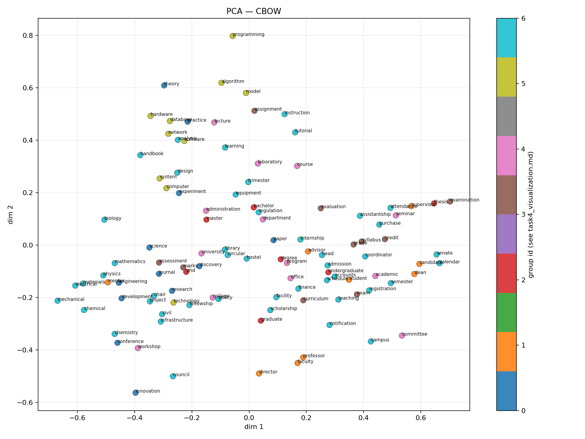
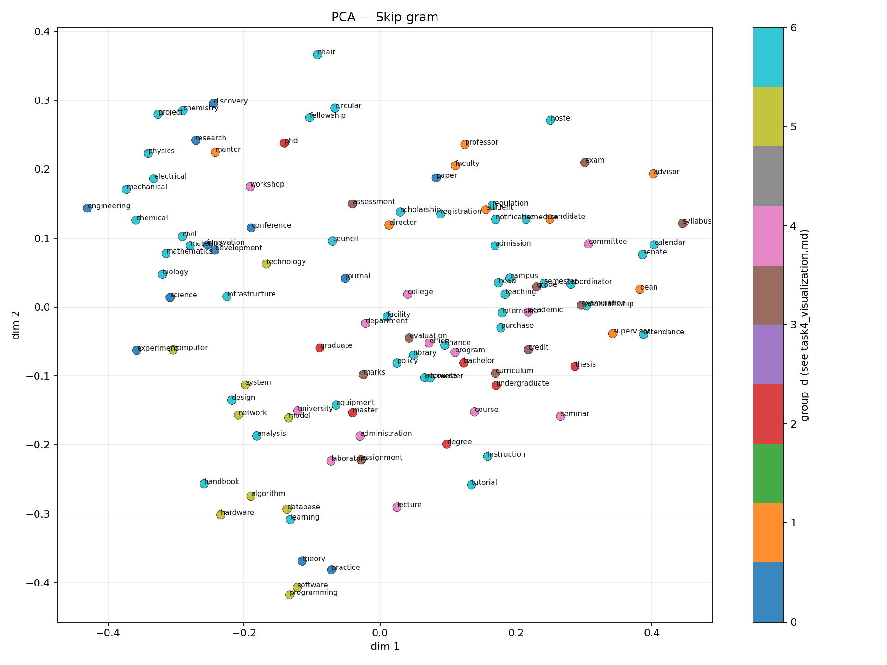

# Problem 1 — IITJ corpus, Word2Vec, and embedding analysis

This report summarizes the **actual run** logged in your terminal (corpus rebuild → Task 2 grid → Task 3 → Task 4). Artifact paths are under `problem1/output/`. *(The course PDF `PA-2.pdf` was not in the repo; sections follow the usual Problem 1 structure: data collection, Word2Vec training and comparison, intrinsic metrics, qualitative semantics, and 2D visualization.)*

---

## 1. Corpus collection (Task 1)

### 1.1 What we built

| Statistic | Value |
| --- | ---: |
| Documents (tokenized units) | 915 |
| Total tokens | 192,621 |
| Distinct types (tokenizer) | 13,846 |
| Gensim vocabulary (`min_count=2`) | 10,145 |

**Pipeline:** Priority seeds (IIT Jodhpur HTML + PDFs, including PG regulations and CSE course PDFs) → **BFS crawl** on `*.iitj.ac.in` (capped) → text extraction → English filter → NLTK tokenization → `corpus_tokens.pkl`.

### 1.2 Crawl summary (terminal)

| Metric | Value |
| --- | ---: |
| HTML pages fetched | 64 |
| PDF files saved | 90 |
| PDF URLs seen | 90 |
| Crawl errors | 1 |

**Note:** `Could not get FontBBox from font descriptor` lines come from **pdfplumber** on some PDF fonts; extraction still completed and the corpus was written successfully.

---

## 2. Word2Vec experiments (Task 2)

### 2.1 Setup

- **Implementation:** `gensim.models.Word2Vec` with **negative sampling** (`ns_exponent=0.75`), `min_count=2`, `epochs=25`, `sorted_vocab=True`.
- **Architectures:** **CBOW** (`sg=0`) vs **Skip-gram** (`sg=1`).
- **Hyperparameter grid (≥2 values per category):**

| Category | Values |
| --- | --- |
| Embedding size `vector_size` | 128, 256 |
| Context window `window` | 5, 10 |
| Negative samples `negative` | 10, 20 |

That is a **2×2×2 full factorial** per architecture → **16 trained models** total.

- **Wall clock:** ~**305 s** for all 16 runs on your machine (CPU; per-run times in table below).

### 2.2 Full results

| Arch | d | win | neg | Train loss | Google acc | Domain acc | Pair sim | sec |
| --- | ---: | ---: | ---: | ---: | ---: | ---: | ---: | ---: |
| CBOW | 128 | 5 | 10 | 1610716 | 0.0044 | **0.20** | 0.313 | 2.2 |
| Skip-gram | 128 | 5 | 10 | 7807942 | 0.0022 | 0.00 | **0.376** | 9.0 |
| CBOW | 128 | 5 | 20 | 1774318 | 0.0022 | 0.00 | 0.269 | 3.7 |
| Skip-gram | 128 | 5 | 20 | 9580040 | 0.0022 | 0.00 | 0.357 | 20.8 |
| CBOW | 128 | 10 | 10 | 1617987 | 0.0000 | 0.00 | 0.341 | 3.8 |
| Skip-gram | 128 | 10 | 10 | 14416260 | 0.0000 | **0.20** | 0.379 | 24.9 |
| CBOW | 128 | 10 | 20 | 1820455 | 0.0022 | 0.00 | 0.273 | 5.8 |
| Skip-gram | 128 | 10 | 20 | 18083214 | 0.0000 | **0.20** | **0.395** | 50.7 |
| CBOW | 256 | 5 | 10 | 1903812 | 0.0022 | 0.00 | 0.315 | 5.0 |
| Skip-gram | 256 | 5 | 10 | 9202089 | 0.0022 | 0.00 | 0.330 | 20.4 |
| CBOW | 256 | 5 | 20 | 2122449 | **0.0066** | 0.00 | 0.273 | 8.1 |
| Skip-gram | 256 | 5 | 20 | 11276896 | 0.0000 | 0.00 | 0.325 | 37.1 |
| CBOW | 256 | 10 | 10 | 1799223 | 0.0022 | **0.20** | 0.341 | 5.3 |
| Skip-gram | 256 | 10 | 10 | 16445476 | 0.0000 | 0.00 | 0.309 | 34.5 |
| CBOW | 256 | 10 | 20 | 2253264 | 0.0000 | 0.00 | 0.276 | 7.9 |
| Skip-gram | 256 | 10 | 20 | 18325516 | 0.0000 | 0.00 | 0.307 | 62.1 |

*Source: `w2v_experiments.csv`. “Train loss” is gensim’s running negative-sampling loss; **do not** compare CBOW vs Skip-gram, or different `negative`, on raw loss.*

### 2.3 Interpretation

1. **Google analogy benchmark** (`questions-words.txt`): Absolute scores stay **near zero**—normal for a **small, domain** corpus where most benchmark words are rare or OOV. Use it **only to compare** runs with identical evaluation settings.
2. **Domain analogies** (`domain_analogies.txt`): A few runs reach **0.20** domain accuracy; the file is short, so this metric is **coarse** and can flip with small embedding changes.
3. **Domain pair cosine similarity** (hand-picked related pairs): Best value **0.395** for **Skip-gram**, `d=128`, `window=10`, `negative=20` — suggests this setting aligns the chosen pairs slightly better than others in this sweep.
4. **Best Google analogy (this table):** **CBOW** `d=256`, `window=5`, `negative=20` at **0.0066**.

---

## 3. Semantic analysis (Task 3)

Task 3 retrains **one CBOW** and **one Skip-gram** model with **fixed** hyperparameters for qualitative comparison: `vector_size=200`, `window=10`, `negative=15`, `epochs=25` (defaults in `task3_semantic.py`) — *not* identical to every grid point above.

### 3.1 Cosine nearest neighbors (summary)

| Query | CBOW — typical neighbors | Skip-gram — typical neighbors |
| --- | --- | --- |
| research | Mixed **local** tokens (e.g. project names, “phase”, “advances”) | More **grant/project**-like terms (e.g. “sponsored”, “project”, acronyms) |
| student | **Registration / semester** context (“programme”, “register”, “semester”) | **Administrative** verbs (“accumulate”, “petition”, “declared”) |
| phd | Strong **funding + lab** terms (“dst-inspire”, “perovskite”, “fellowship”) | Similar **STEM** collocations; overlaps on “dst-inspire” |
| exam | **Form-field** neighbors (“marital”, “belongs”, “status”, “id”) — *web form boilerplate near the word “exam”* | Same pattern, slightly different order |

**Takeaway:** Neighbors reflect **document co-occurrence** on IITJ pages (including forms and tables), not abstract synonyms. That is expected for an institute crawl.

### 3.2 Vector-offset analogies (highlights)

- **`ug : btech :: pg : ?`:** Both models rank **undergraduation**, **diploma**, **bsc**-type tokens highly — plausible **degree-level** associations for this corpus.
- **`course : credit :: degree : ?`:** CBOW favors **minimum / requirements / credits** — matches **regulation** language.
- **`science : engineering :: theory : ?`:** Skip-gram’s top hit includes **practice** (rank 1), which matches the intended *theory vs practice* axis **weakly**; CBOW lists more **proper nouns / niche terms** (domain noise).

Full tables: `task3_semantic_analysis.md`, `task3_neighbors.csv`.

---

## 4. Visualization (Task 4)

I projected **107** word types present in **both** models (L2-normalized embeddings). **PCA** gives a linear global view; **t-SNE** emphasizes local neighborhoods (perplexity 21). Colors = coarse manual groups (research, people, credentials, assessment, org, tech, other).

### 4.1 CBOW

*~20.5% variance on first two PCA components (from `task4_visualization.md`).*

### 4.2 Skip-gram

*~10.2% variance on first two PCA components.*

### 4.3 Reading the plots

- **PCA:** Skip-gram’s first two components explain **less** cumulative variance than CBOW here; both are **low**, which is normal when many dimensions participate and groups overlap.
- **t-SNE:** You should see **theme-colored** clumps; **within-cluster** distance is more meaningful than **between-cluster** distance.

---

## 5. Limitations and reproducibility

1. **Corpus size:** ~192k tokens is moderate; intrinsic benchmarks stay **noisy**.
2. **Domain vs general English:** Google analogy scores stay tiny; prioritize **domain analogies**, **pair similarity**, and **qualitative** checks.
3. **Boilerplate:** Words like “exam” pick up **form** context; cleaning (template stripping) could be tightened in a future revision.
4. **Re-run:** `python -m problem1.build_corpus --rebuild` then `train_word2vec` → `task3_semantic` → `task4_visualize`.

---

## 6. File index

| File | Content |
| --- | --- |
| `corpus_meta.json` | Corpus statistics + source sample |
| `corpus_tokens.pkl` | Tokenized sentences for training |
| `w2v_experiments.csv` | Full Task 2 grid metrics |
| `problem1_task2_report.md` | Auto Task 2 report (subset of §2) |
| `task3_neighbors.csv` | Neighbor dump |
| `task3_semantic_analysis.md` | Task 3 write-up |
| `task4_visualization.md` | Plot captions |
| `plots/task4_*.png` | PCA and t-SNE figures |

---

*Generated for the run described in the assignment workflow; numbers match `w2v_experiments.csv` and terminal crawl/train logs.*
